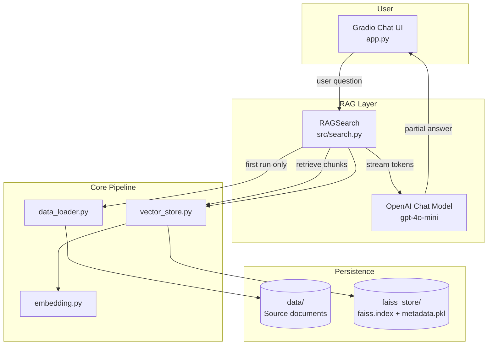
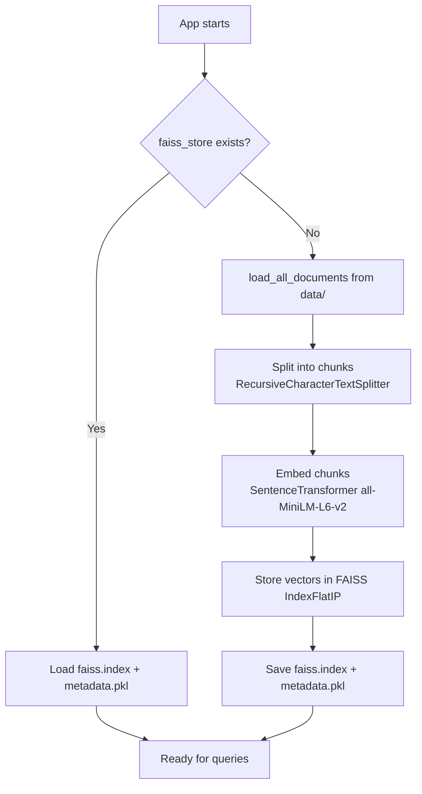
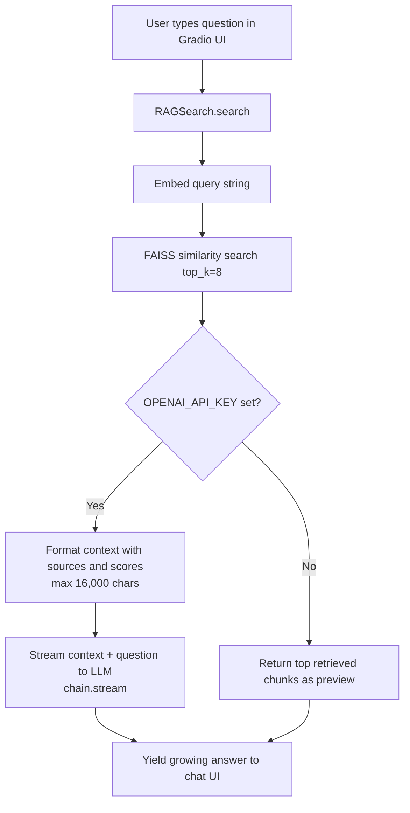
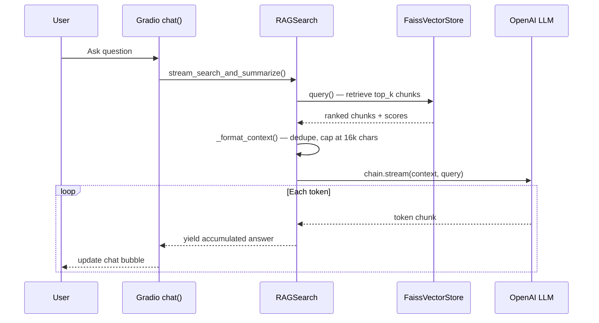

# RAG Document Chatbot

A local retrieval-augmented generation (RAG) application that loads documents from a `data/` folder, indexes them into a FAISS vector store, and serves a Gradio chatbot on `localhost` to answer questions grounded in your source files.

## What it does

1. **Ingest** — Reads PDF, TXT, CSV, and XLSX files from `data/`.
2. **Index** — Splits documents into chunks, embeds them with `all-MiniLM-L6-v2`, and saves vectors to `faiss_store/`.
3. **Retrieve** — Finds the most relevant chunks for a user question using cosine similarity (inner product on normalized vectors).
4. **Generate** — Sends retrieved context to OpenAI (`gpt-4o-mini`) and streams a detailed, structured natural-language answer in real time.

---

## High-level architecture



---

## Indexing flow (first run or after rebuild)

Embeddings for your documents are **not** recreated on every startup. They are built once and saved to disk. On later runs, the app loads the existing index.



---

## Query and chat flow

Answers are **streamed token-by-token** to the Gradio UI as the LLM generates them. The prompt is tuned to produce **detailed, well-structured responses** with specifics and examples from the retrieved context.



### Streaming sequence



---

## Project structure

```
rag/
├── app.py                 # Gradio chatbot entry point (localhost)
├── data/                  # Your source documents (not committed by default)
├── faiss_store/           # Generated vector index (auto-created)
│   ├── faiss.index        # FAISS embedding vectors
│   └── metadata.pkl       # Chunk text + source metadata per vector
├── requirements.txt
├── .env                   # OPENAI_API_KEY (optional, for LLM answers)
├── src/
│   ├── __init__.py
│   ├── data_loader.py     # Load files from data/ into LangChain Documents
│   ├── embedding.py       # Chunking + embedding pipeline
│   ├── vector_store.py    # FAISS index build, save, load, search
│   └── search.py          # RAG orchestration (retrieve + summarize)
└── README.md
```

---

## The `data/` folder

The `data/` folder holds your **source documents**. This is the only place you manually add or replace files.

| Format | Extension | Loader used |
|--------|-----------|-------------|
| PDF | `.pdf` | `PyPDFLoader` (one LangChain `Document` per page) |
| Plain text | `.txt` | `TextLoader` (UTF-8) |
| CSV | `.csv` | `CSVLoader` (one row per document) |
| Excel | `.xlsx` | `UnstructuredExcelLoader` |

**Behavior:**
- Files are discovered recursively (`**/*.pdf`, etc.) under `data/`.
- Each loaded item becomes a LangChain `Document` with `page_content` (text) and `metadata` (e.g. `source` file path).
- Only files present in `data/` at **index build time** are searchable. Adding new files later does not update the index automatically.

**Example:**
```
data/
└── NIPS-2017-attention-is-all-you-need-Paper.pdf
```

To index new or replaced files, delete `faiss_store/` and restart the app (see [Rebuilding the index](#rebuilding-the-index)).

---

## The `faiss_store/` folder

`faiss_store/` is the **on-disk vector database**. It is created automatically the first time documents are indexed. It is not a traditional SQL/NoSQL database — it uses [FAISS](https://github.com/facebookresearch/faiss) flat index files.

| File | Purpose |
|------|---------|
| `faiss.index` | Binary FAISS index containing all document chunk embedding vectors |
| `metadata.pkl` | Pickled Python list aligned by index position — each entry holds `content`, `source`, and other chunk metadata |

**How vectors map to text:**
- Vector at position `i` in `faiss.index` corresponds to `metadata[i]` in `metadata.pkl`.
- During search, FAISS returns indices and similarity scores; the app looks up the matching metadata to get the original chunk text.

**When it is used:**
- **Exists on startup** → loaded from disk (fast, no re-embedding).
- **Missing on startup** → full rebuild from `data/`, then saved here.

**When to delete it:**
- You add, remove, or replace files in `data/`.
- You change `chunk_size`, `chunk_overlap`, or `embedding_model`.

---

## Source code reference (`src/`)

### `src/data_loader.py`

Entry point for document ingestion.

- **`load_all_documents(data_dir=None)`** — Scans `data/` (or a custom path) and returns a list of LangChain `Document` objects.
- Uses `PROJECT_ROOT` to resolve paths relative to the repo root.
- Logs which files were found and loaded; skips files that fail with an error message.

```python
from src.data_loader import load_all_documents

documents = load_all_documents()
print(f"Loaded {len(documents)} document pages/rows")
```

---

### `src/embedding.py`

Handles text splitting and embedding via `EmbeddingPipeline`.

| Setting | Default | Description |
|---------|---------|-------------|
| `model_name` | `all-MiniLM-L6-v2` | Sentence-transformers model (384-dim vectors) |
| `chunk_size` | `1000` | Max characters per chunk |
| `chunk_overlap` | `200` | Overlap between consecutive chunks |
| `batch_size` | `32` | Embedding batch size |
| `normalize_embeddings` | `True` | L2-normalize vectors for cosine similarity via inner product |

**Key methods:**
- **`chunk_documents(documents)`** — Splits documents with `RecursiveCharacterTextSplitter`, filters empty chunks.
- **`embed_chunks(chunks)`** — Encodes chunk text into a `numpy` float32 array of shape `(n_chunks, 384)`.

---

### `src/vector_store.py`

FAISS-backed vector store for persistence and similarity search.

**`FaissVectorStore` responsibilities:**

| Method | Description |
|--------|-------------|
| `exists()` | Returns `True` if both `faiss.index` and `metadata.pkl` exist |
| `build_from_documents(docs)` | Chunk → embed → add to in-memory index |
| `save()` | Write index and metadata to `faiss_store/` |
| `load()` | Read index and metadata from disk |
| `query(text, top_k)` | Embed query string and return top matches |
| `search(embedding, top_k)` | Low-level FAISS search on a pre-computed vector |

**Search details:**
- Uses `faiss.IndexFlatIP` (inner product). Because embeddings are normalized, inner product equals cosine similarity.
- Each result is a dict: `{ "index", "score", "metadata" }`.

---

### `src/search.py`

High-level RAG orchestrator — ties together loading, vector search, and LLM generation with **streaming support**.

**`RAGSearch` lifecycle on init:**
1. Create `FaissVectorStore`.
2. If index exists → `load()`.
3. Else → `load_all_documents()` → `build_from_documents()` → `save()`.

**Key methods:**

| Method | Description |
|--------|-------------|
| `search(query, top_k=5)` | Retrieval only — returns ranked chunk results |
| `stream_search_and_summarize(query, top_k=5)` | Retrieval + **streaming** LLM answer (yields growing text) |
| `search_and_summarize(query, top_k=5)` | Retrieval + full LLM answer (collects streamed output) |

**Answer quality:**
- The system prompt instructs the LLM to write **detailed, thorough responses** with specific facts, examples, and clear structure (paragraphs or bullet points).
- Retrieved context is deduplicated, annotated with source filenames and scores, and capped at **16,000 characters** to give the model more material for in-depth answers.

**Optimizations:**
- LLM and LangChain chain are **lazy-loaded** (only when summarization is needed).
- `search_and_summarize()` reuses `stream_search_and_summarize()` internally — one code path for both streaming and non-streaming use.
- Optional `min_score` filters out low-relevance hits before generation.

---

### `app.py`

Gradio web UI entry point with **real-time answer streaming**.

- Loads `RAGSearch` once at startup.
- Hosts a chat interface at `http://127.0.0.1:7860` (or the next free port if 7860 is busy).
- `chat()` is a **generator** that yields partial responses — Gradio updates the chat bubble as tokens arrive.
- Retrieves **8 chunks** (`TOP_K = 8`) per question for richer context.
- If `OPENAI_API_KEY` is set → streams detailed RAG answers via `stream_search_and_summarize()`.
- If not set → returns top retrieved chunks as a fallback preview (600 chars per chunk).


---

## Setup

### 1. Create and activate a virtual environment

```powershell
python -m venv venv
venv\Scripts\Activate.ps1
```

### 2. Install dependencies

```powershell
pip install -r requirements.txt
```

### 3. Add documents

Place your files in the `data/` folder:

```
data/
├── report.pdf
├── notes.txt
└── dataset.csv
```

### 4. Configure OpenAI (optional, for generated answers)

Create a `.env` file in the project root:

```env
OPENAI_API_KEY=sk-your-key-here
```

Without this key, the chatbot still runs but only shows retrieved document chunks instead of LLM-generated answers.

### 5. Run the chatbot

```powershell
python app.py
```

Open the URL printed in the terminal (e.g. `http://127.0.0.1:7860`).

To use a specific port:

```powershell
$env:GRADIO_SERVER_PORT = "8080"
python app.py
```

---

## Rebuilding the index

The index is rebuilt only when `faiss_store/` is missing. To re-index after changing source files or embedding settings:

```powershell
Remove-Item -Recurse -Force faiss_store
python app.py
```

---

## Configuration reference

These values are set in `app.py` and passed to `RAGSearch`:

| Parameter | Default | Where to change |
|-----------|---------|-----------------|
| `persist_directory` | `faiss_store` | `app.py` → `PERSIST_DIR` |
| `embedding_model` | `all-MiniLM-L6-v2` | `app.py` → `RAGSearch(...)` |
| `chunk_size` | `1000` | `app.py` → `RAGSearch(...)` |
| `chunk_overlap` | `200` | `app.py` → `RAGSearch(...)` |
| `llm_model` | `gpt-4o-mini` | `src/search.py` → `RAGSearch(...)` |
| `top_k` | `8` | `app.py` → `TOP_K` |
| `max_context_chars` | `16000` | `src/search.py` → `_format_context()` |
| `GRADIO_SERVER_PORT` | `7860` | Environment variable |

---

## Programmatic usage

Use the RAG pipeline directly without the Gradio UI:

```python
from src.search import RAGSearch

rag = RAGSearch()

# Retrieval only
results = rag.search("What is attention?", top_k=8)
for r in results:
    print(r["score"], r["metadata"]["content"][:200])

# Streaming answer (requires OPENAI_API_KEY)
for partial in rag.stream_search_and_summarize("What is attention?", top_k=8):
    print(partial, end="\r")  # growing answer
print()  # final newline

# Full answer at once (requires OPENAI_API_KEY)
answer = rag.search_and_summarize("What is attention?", top_k=8)
print(answer)
```

---

## Dependencies

| Package | Role |
|---------|------|
| `sentence-transformers` | Local embedding model |
| `faiss-cpu` | Vector similarity search |
| `langchain-*` | Document loaders, text splitters, LLM chain |
| `langchain-openai` | OpenAI chat model integration |
| `gradio` | Local chatbot web UI |
| `python-dotenv` | Load `.env` for API keys |
| `pypdf`, `openpyxl`, `unstructured` | Document parsing |

---

## Troubleshooting

| Issue | Solution |
|-------|----------|
| Port 7860 already in use | The app auto-picks the next free port; check the terminal for the actual URL |
| `No documents found in data/` | Add supported files to `data/` before starting |
| Answers seem outdated or wrong | Delete `faiss_store/` and restart to rebuild from current `data/` files |
| Only chunk previews, no LLM answers | Set `OPENAI_API_KEY` in `.env` |
| Answers not streaming | Ensure you are running the latest `app.py` — `chat()` must be a generator using `yield` |
| First startup is slow | Normal — embedding all documents on first run takes time; later runs load from disk |
